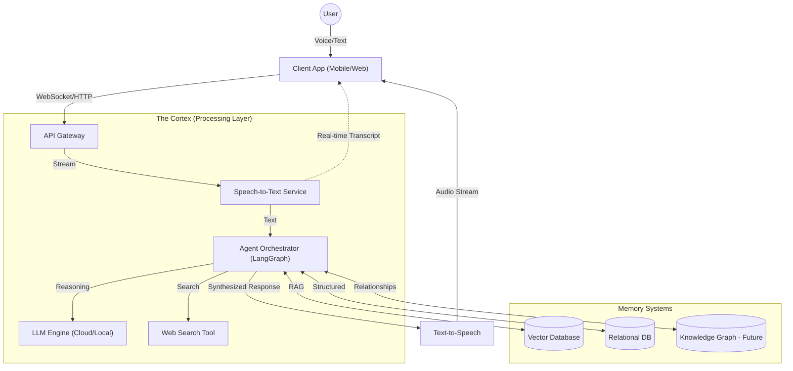

# Architecture & Technical Design

> **Status**: Draft
> **Version**: 1.0.0

This document outlines the technical architecture for "The Second Brain". It is designed to be **modular, scalable, and event-driven**, ensuring it can handle the real-time demands of voice interaction while maintaining a complex, evolving knowledge graph.

## 1. High-Level System Overview

The system follows a **Modern Event-Driven Microservices** pattern (or modular monolith for MVP), centered around a "Cortex" that processes streams of data.



## 2. Component Details

### 2.1. Client Layer (The Interface)
*   **Tech Stack**: 
    *   **Mobile**: React Native (Expo) or Flutter. *Rationale: Native performance for microphone/audio handling is critical.*
    *   **Web**: Next.js (React).
*   **Key Responsibilities**:
    *   **Audio Capture**: High-fidelity audio recording (16kHz+ mono).
    *   **VAD (Voice Activity Detection)**: Local detection of silence to save bandwidth and trigger "end of turn".
    *   **Optimistic UI**: Display user's speech transcript immediately as it streams back, before the final answer is ready.
    *   **Local Caching**: Store recent chats and critical memories offline (using SQLite or WatermelonDB).

### 2.2. API Gateway & Transport
*   **Tech Stack**: Python (FastAPI) or Go.
*   **Protocol**: 
    *   **WebSockets**: For bi-directional voice streaming and immediate text tokens.
    *   **REST**: For standard CRUD (updating profile, retrieving history).
*   **Auth**: OAuth2 / JWT.

### 2.3. The Cortex (Brain Core)
This is the logic center. It dictates *what to do* with the user's input.
*   **Tech Stack**: Python (LangChain / LangGraph).
*   **Modules**:
    *   **Transcription (Ear)**: 
        *   *Cloud*: Deepgram or OpenAI Whisper.
        *   *Local*: Whisper.cpp or specialized edge models for privacy.
    *   **Intent Router**: A lightweight LLM call to classify input: `SAVE_MEMORY`, `QUERY`, `ACTION`, `AMBIGUOUS`.
    *   **Memory Manager**:
        *   Extracts facts.
        *   Checks for contradictions in *existing* vector store.
        *   Decides whether to *update* an old fact or *add* a new context.

### 2.4. Storage Layer (The Memory)
We use a **Hybrid Storage Strategy** to handle the complexity of human memory.

1.  **Vector Database (Semantic Memory)**
    *   **Tech**: Pinecone, Weaviate, or `pgvector`.
    *   **Usage**: Stores embeddings of every note, chat, and summarized web page.
    *   **Schema**:
        ```json
        {
          "id": "uuid",
          "vectors": [...],
          "metadata": {
            "text": "I hate football now.",
            "timestamp": "2023-10-27T10:00:00Z",
            "type": "preference",
            "validity_score": 1.0  // Decreases if contradicted later
          }
        }
        ```

2.  **Relational Database (Structured Memory)**
    *   **Tech**: PostgreSQL.
    *   **Usage**: User profile, conversation logs, raw audio metadata, and precise configuration.

3.  **Knowledge Graph (Associative Memory - Future)**
    *   **Tech**: Neo4j or simple lateral links in Postgres.
    *   **Usage**: To explicitly map entities. `(User) -[HAS_INTEREST]-> (Gardening)`. This allows for multi-hop reasoning that vector search misses.

## 3. Key Workflows

### 3.1. The "Ingest & Evolve" Workflow (Write Path)
1.  **Receive**: Audio stream received via WebSocket.
2.  **Transcribe**: Real-time STT converts to text.
3.  **Classify**: "User is stating a new preference."
4.  **Retrieval Check**: Search Vector DB for "current preferences about X".
5.  **Conflict Resolution**:
    *   *Found*: "User loved football (2022)."
    *   *Input*: "I hate football."
    *   *Action*: Mark 2022 entry as `archived` / `legacy`. Create new entry with higher weight.
6.  **Store**: Save new vector.
7.  **Ack**: Notify user "Got it. Updated your preference on Football."

### 3.2. The "Recall & Search" Workflow (Read Path)
1.  **Receive**: "What should I do this weekend?"
2.  **Context Construction**:
    *   Fetch *recent* preferences (hates football, loves gardening).
    *   Fetch *external context* (Weather: Sunny, Location: Home).
3.  **Expansion**: Agent realizes "Gardening" requires "Tomatoes" (based on recent search).
4.  **Web Search (if needed)**: "Best tomato planting dates for [Location]".
5.  **Synthesis**: LLM combines memory ("Loves gardening") + context ("Sunny") + web knowledge ("Plant tomatoes now").
6.  **Response**: "It's sunny! Since you're into gardening now, maybe plant those tomatoes? I found a guide..."

## 4. Scalability & Future-Proofing

### 4.1. Handling Data Growth
*   **Tiered Storage**:
    *   **Hot**: Recent memories (last 30 days) in fast RAM/Cache (Redis).
    *   **Warm**: Standard Vector Index.
    *   **Cold**: Archived/Outdated memories moved to cheaper object storage (S3), only retrieved for "Do you remember when..." queries.
*   **Summarization Jobs**: Nightly cron jobs that take the day's verbose logs and compress them into concise "Episodic Memories" to keep the context window clean.

### 4.2. Model Agnosticism
The architecture is decoupled from specific LLM providers.
*   **Router Pattern**: We can swap GPT-4o for Claude 3.5 or a local Llama 3 model for privacy-sensitive tasks without changing the application logic.

### 4.3. Privacy First
*   **PII Scrubbing**: Before sending data to any cloud LLM, a local presidio layer can scrub names/phones.
*   **Local-Only Mode**: The architecture supports running the STT and embeddings locally on device (if powerful enough) or on a personal home server.
*   **On-Device Inference**:
    *   Support for running quantized models (e.g., Llama 3 8B, Phi-3) directly on the client or a local edge server (Ollama).
    *   This ensures full functionality even without internet access for core memory retrieval features.

## 5. Deployment Strategy
*   **Containerization**: Docker for all services (API, DB, Worker).
*   **Orchestration**: Kubernetes (K8s) or simpler Docker Compose for self-hosting.
*   **CI/CD**: GitHub Actions to run tests and deploy to staging.
